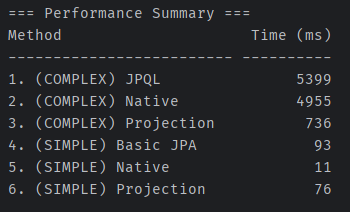

# AWS 배포

## health check API
```
http://3.39.77.72:8080/health
```

## EC2


## RDS


## S3


# 대용량 데이터 쿼리 성능 측정

## 개요

처음에는 testcontainers를 적용해 컨테이너마다 독립적인 테스트 환경을 구성하려고 했으나, 실행 시간이 너무 오래 걸렸다.
그래서 도커 컨테이너를 하나 띄워놓고 테스트하는 방법을 채택했다.

테스트 구성은 다음과 같다.

1. 파이썬 스크립트를 사용해 테스트용 유저 데이터 백 만건 생성 (csv 파일)
2. 도커 컨테이너 생성 시 스크립트를 사용해 csv 파일 로드
3. 데이터가 삽입된 컨테이너를 사용해 쿼리 성능 측정 테스트 코드 실행
4. 만약 스크립트가 수정되었다면 컨테이너를 삭제했다가 다시 생성

쿼리가 단순했을 때, 복잡했을 때의 차이도 보기 위해서 두 가지 기능의 쿼리를 구현했다. </br>
쿼리는 JPA(JPQL), Native Query, Projection 세 가지 방식으로 구현했다.

예시)

SIMPLE
```java
Optional<User> findByNickname(String nickname);
```
COMPLEX
```java
@Query(value = ""
        + "SELECT new org.example.expert.domain.user.dto.response.SimpleUserDto("
        + "  u.id, u.email, u.nickname, u.userRole, "
        + "  (SELECT COUNT(u2) FROM User u2 WHERE u2.userRole = u.userRole), "
        + "  CASE WHEN u.userRole = org.example.expert.domain.user.enums.UserRole.ADMIN THEN 'AdminUser' ELSE 'NormalUser' END"
        + ") "
        + "FROM User u "
        + "WHERE u.nickname LIKE CONCAT(:prefix, '%') "
        + "ORDER BY u.createdAt DESC",
        countQuery = "SELECT COUNT(u) FROM User u WHERE u.nickname LIKE CONCAT(:prefix, '%')"
)
Page<SimpleUserDto> findSimpleByNicknamePrefix(
        @Param("prefix") String prefix,
        Pageable pageable
);
```

따라서 총 테스트 케이스는 6개가 된다. (단순 쿼리 3개, 복잡한 쿼리 3개)

## 테스트 실행 방법

#### 1. csv 파일 생성

프로젝트 루트 경로에 있는 [create_users.py](./create_users.py) 실행

```bash
python3.exe create_users.py
```

생성된 csv 파일을 `src/test/resources/db/init`으로 이동

#### 2. local.cnf 파일 권한 변경

mysql의 local infile을 가능하도록 하기 위한 설정 파일인 `local.cnf` 파일을 읽기 전용으로 설정


#### 3. application.yml 설정

자동으로 테이블이 생성되면 안 되므로 `spring.jpa.hibernate.ddl-auto=none`으로 설정

```yml
spring:
    jpa:
        properties:
            hibernate:
                dialect: org.hibernate.dialect.MySQLDialect
                format_sql: true
                use_sql_comments: true
                show_sql: true
        hibernate:
            ddl-auto: none
    datasource:
        driver-class-name: com.mysql.cj.jdbc.Driver
        url: jdbc:mysql://localhost:3307/testdb
        username: test
        password: test
        hikari:
            auto-commit: true
```

#### 4. users_init.sql 설정

인덱싱 적용 유무에 따른 차이를 테스트하고 싶다면 sql 파일의 인덱스 추가 부분을 주석 처리한다. 

#### 5. docker 컨테이너 실행

`docker-compose.test.yml`을 실행해 컨테이너를 생성한다.

이 때 컨테이너 실행 후 정상적으로 동작하는지 확인해야 한다. (데이터 로딩에 시간이 조금 걸림)

환경 차이에 따라 데이터를 LOAD하는 부분에서 에러가 발생해 컨테이너가 중단되었을 수도 있기 때문

#### 6. 테스트 코드 실행

[UserQueryPerfTest](src/test/java/org/example/expert/performance/user/UserQueryPerfTest.java) 테스트 코드를 실행한다.

(테스트 시 많은 부하가 걸리므로 `@Disabled` 어노테이션이 적용되어 있다. 테스트 실행 전 해당 어노테이션을 주석 처리해주자.)

`@AfterAll`에서 테스트 결과를 정리해서 보여주고 있다. 테스트 결과의 클래스 항목을 선택해 결과를 확인해보자.


## 실행 결과

- 대체로 기본 JPA 메서드가 가장 느리다.
- `nickname` 칼럼에 인덱스 적용 후 전반적으로 성능이 향상된 것을 확인할 수 있다.
- 서브쿼리, WHERE, ORDER BY 등을 사용한 COMPLEX 쿼리는 인덱스 적용 후 오히려 느려졌다.

### 인덱스 적용 전


### 인덱스 적용 후

